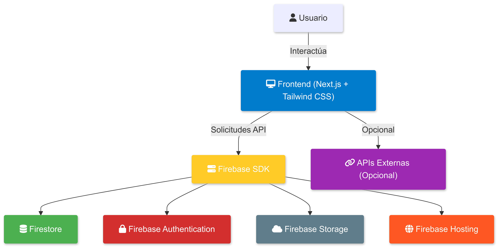
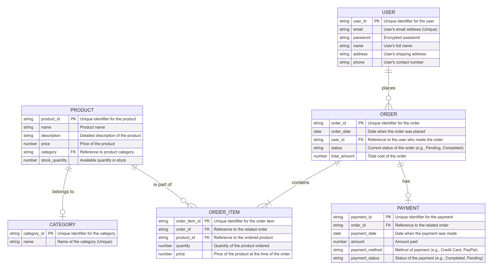

## 0. Ficha del Proyecto

### **0.1. Tu Nombre Completo:**

Anderson Antonio Prado Martinez

### **0.2. Nombre del Proyecto:**

Los Prado

### **0.3. Descripción Breve del Proyecto:**

Una plataforma de comercio electrónico que permite a los usuarios registrase, loguearse, comprar productos, gestionar inventarios, realizar pagos y seguir el estado de sus pedidos.

### **0.4. URL del Proyecto:**

(No especificada de momento)

### **0.5. URL o Archivo Comprimido del Repositorio:**

(No especificada de momento)

---

## 1. Descripción General del Producto

### **1.1. Objetivo:**

Facilitar la compra y venta de productos en línea, proporcionando una experiencia completa que incluye gestión de inventarios, pedidos, y pagos.

### **1.2. Características y Funcionalidades Principales:**

- Gestión de usuarios (registro e inicio de sesión).
- Gestión de productos e inventarios.
- Procesamiento de pedidos y actualización automática de estados.
- Gestión de categorías de productos.
- Integración de pagos.
- Historial de pedidos.
- Seguridad en transacciones.

### **1.3. Diseño y Experiencia de Usuario:**

El diseño de la plataforma de ecommerce está centrado en la facilidad de uso y la navegación intuitiva. Los principales elementos de la experiencia de usuario son:

1. **Página de Inicio:** La página inicial muestra una barra de búsqueda en la parte superior, junto con un menú de categorías. A continuación, se destacan productos populares y ofertas especiales. Los usuarios pueden ver productos recientes o destacados y acceder a diferentes secciones de la tienda desde esta pantalla.

2. **Página de Productos:** Al seleccionar una categoría o realizar una búsqueda, los usuarios son llevados a una página de listado de productos, donde pueden ver imágenes, precios y descripciones breves. La experiencia incluye la posibilidad de aplicar filtros (por precio, categoría, popularidad) y ordenar los resultados.

3. **Página de Detalle del Producto:** Al seleccionar un producto, se muestra una página detallada que incluye una imagen ampliada, una descripción completa, reseñas de otros usuarios, opciones de cantidad y un botón para añadir al carrito. Esta página también muestra productos relacionados para fomentar compras adicionales.

4. **Carrito de Compras:** El carrito de compras es accesible desde cualquier parte de la plataforma. Muestra un resumen de los productos añadidos, la cantidad, el precio total y opciones para modificar o eliminar productos. Un botón de "Proceder al Pago" guía al usuario al siguiente paso.

5. **Proceso de Pago:** El proceso de pago es sencillo y está dividido en pasos claros: información de envío, método de pago, revisión de pedido y confirmación. Durante este flujo, los usuarios pueden introducir direcciones de envío, seleccionar métodos de pago (tarjeta de crédito, PayPal, etc.) y aplicar códigos de descuento.

6. **Gestión de Pedidos:** Los usuarios pueden acceder a un panel de "Mi Cuenta" donde encuentran el historial de sus pedidos. Aquí pueden ver el estado de sus pedidos (en proceso, enviado, entregado) y detalles adicionales como el método de pago y la dirección de envío.

Este diseño está pensado para ser responsivo, adaptándose a dispositivos móviles, tabletas y computadoras de escritorio para ofrecer una experiencia de usuario óptima en cualquier entorno.

### **1.4. Instrucciones de Instalación:**

**Requisitos Previos:**

- Node.js (versión 14 o superior) y npm (se instala junto con Node.js)
- Editor de código (recomendado: Visual Studio Code)

**Paso 1: Instalar Dependencias**
Ejecuta el siguiente comando para instalar las dependencias necesarias del proyecto:

```bash
npm install
```

**Paso 2: Ejecutar el Proyecto**

```bash
npm run dev
```

---

## 2. Arquitectura del Sistema

### **2.1. Diagrama de Arquitectura:**



### **2.2. Descripción de Componentes Principales:**

- **Frontend (Next.js + Tailwind CSS):**

  - **Framework:** Next.js proporciona una estructura basada en React para crear aplicaciones web. Se eligió Next.js por su capacidad para el rendering híbrido (SSR y CSR), lo que permite un mejor SEO y carga dinámica de contenido.
  - **Estilo:** Tailwind CSS permite estilos modulares y reutilizables, ayudando a crear un diseño consistente y atractivo con un esfuerzo mínimo.
  - **Componentes:** La aplicación utiliza componentes React para las distintas vistas, como la página de inicio, lista de productos, carrito de compras, y página de detalles del producto. Estos componentes interactúan con el SDK de Firebase para obtener y gestionar datos.

- **Backend (Firebase SDK):**

  - **Base de Datos:** Firebase Firestore se utiliza como la base de datos NoSQL para almacenar datos de productos, usuarios, pedidos, y cualquier otra información relevante. Su naturaleza en tiempo real facilita la sincronización instantánea de datos entre la aplicación y los usuarios.
  - **Autenticación:** Firebase Authentication se encarga de gestionar el registro e inicio de sesión de usuarios utilizando distintos métodos (correo electrónico, redes sociales, etc.).
  - **Almacenamiento:** Firebase Storage se utiliza para almacenar imágenes y archivos asociados con los productos.

- **Integraciones (Opcional):** La arquitectura permite la integración con APIs externas para funcionalidades adicionales, como servicios de pago o análisis de datos.

### **2.3. Patrón de Arquitectura:**

La aplicación sigue una arquitectura basada en el modelo **JAMstack** (JavaScript, APIs, Markup):

- **JavaScript:** La lógica de la aplicación se implementa en el frontend utilizando Next.js.
- **APIs:** Firebase actúa como un backend-as-a-service, manejando las solicitudes de la aplicación a través de su SDK.
- **Markup:** El frontend se construye de forma estática o dinámica mediante Next.js, mejorando la velocidad de carga y la experiencia de usuario.

**Justificación de la Arquitectura:**

- **Escalabilidad:** Firebase es escalable y maneja automáticamente la infraestructura en segundo plano, lo que es ideal para aplicaciones que esperan crecer.
- **Desarrollo Rápido:** Next.js, combinado con Firebase y Tailwind CSS, permite un desarrollo rápido y centrado en la experiencia de usuario.
- **Menor Mantenimiento:** Firebase reduce la carga de mantenimiento al ofrecer servicios como autenticación y bases de datos listas para usar.
- **Flexibilidad:** Next.js permite el uso de SSR y CSR según las necesidades de cada página, proporcionando un equilibrio entre rendimiento y experiencia de usuario.

### **2.4. Beneficios Principales:**

- **Rendimiento:** Gracias a Next.js y al uso del renderizado del lado del servidor (SSR) y del lado del cliente (CSR), la aplicación ofrece una experiencia rápida y eficiente.
- **Sincronización en Tiempo Real:** Firebase proporciona sincronización de datos en tiempo real, facilitando la actualización inmediata del inventario y del estado de los pedidos.
- **Despliegue Rápido:** Firebase Hosting y las capacidades de Next.js permiten un despliegue ágil de la aplicación.
- **Seguridad:** Con Firebase Authentication y el uso de HTTPS, los datos de los usuarios están protegidos de manera efectiva.

### **2.5. Sacrificios o Déficits:**

- **Dependencia de Firebase:** Al utilizar Firebase como backend, el proyecto se vuelve dependiente de la infraestructura y los precios de Firebase, lo que podría ser una limitación si se desea migrar a otra solución en el futuro.
- **Limitaciones de Consultas:** Firebase Firestore tiene ciertas limitaciones en la realización de consultas complejas, lo que podría requerir refactorización si se necesitan operaciones de datos más avanzadas.
- **Configuración Inicial:** La configuración inicial de Firebase puede ser compleja para quienes no estén familiarizados con sus servicios y la correcta gestión de permisos.
- **SEO Parcial:** Aunque Next.js mejora el SEO con SSR, algunas funcionalidades que dependen del CSR pueden no ser tan optimizadas para los motores de búsqueda.

### **2.6. Tests:**

- Pruebas unitarias y de integración para asegurar el manejo adecuado de errores.
- Pruebas de seguridad mediante penetración y validación de entradas.

---

## 3. Modelo de Datos

### **3.1. Diagrama del Modelo de Datos:**



### **3.2. Descripción de Entidades Principales:**

1. **USER**

   - `user_id`: `string`, PK, identificador único para cada usuario.
   - `email`: `string`, único, almacena la dirección de correo electrónico del usuario.
   - `password`: `string`, almacena la contraseña cifrada del usuario.
   - `name`: `string`, almacena el nombre completo del usuario.
   - `address`: `string`, almacena la dirección de envío del usuario.
   - `phone`: `string`, almacena el número de contacto del usuario.

2. **PRODUCT**

   - `product_id`: `string`, PK, identificador único para cada producto.
   - `name`: `string`, almacena el nombre del producto.
   - `description`: `string`, descripción detallada del producto.
   - `price`: `number`, almacena el precio del producto.
   - `category`: `string`, FK, referencia a la entidad `CATEGORY` para categorizar el producto.
   - `stock_quantity`: `number`, almacena la cantidad disponible en stock.

3. **CATEGORY**

   - `category_id`: `string`, PK, identificador único para cada categoría.
   - `name`: `string`, único, almacena el nombre de la categoría.

4. **ORDER**

   - `order_id`: `string`, PK, identificador único para cada pedido.
   - `order_date`: `date`, almacena la fecha en la que se realizó el pedido.
   - `user_id`: `string`, FK, referencia a la entidad `USER` que indica quién realizó el pedido.
   - `status`: `string`, almacena el estado actual del pedido (e.g., "Pendiente", "Completado").
   - `total_amount`: `number`, almacena el costo total del pedido.

5. **ORDER_ITEM**

   - `order_item_id`: `string`, PK, identificador único para cada ítem en un pedido.
   - `order_id`: `string`, FK, referencia a la entidad `ORDER`.
   - `product_id`: `string`, FK, referencia a la entidad `PRODUCT`.
   - `quantity`: `number`, almacena la cantidad del producto pedido.
   - `price`: `number`, almacena el precio del producto al momento del pedido.

6. **PAYMENT**
   - `payment_id`: `string`, PK, identificador único para cada pago.
   - `order_id`: `string`, FK, referencia a la entidad `ORDER`.
   - `payment_date`: `date`, almacena la fecha en que se realizó el pago.
   - `amount`: `number`, almacena la cantidad pagada.
   - `payment_method`: `string`, almacena el método de pago (e.g., "Tarjeta de Crédito", "PayPal").
   - `payment_status`: `string`, almacena el estado del pago (e.g., "Completado", "Pendiente").

---

## 4. Especificación de la API

### **4.1. Descripción General**

- **Nombre de la API:** Los Prado API
- **Versión:** 1.0
- **Autenticación:** JWT (JSON Web Token)
- **Endpoints principales:**
  - **Usuarios:** CRUD para gestión de usuarios.
  - **Productos:** CRUD para gestión de productos.
  - **Pedidos:** Gestión de pedidos por usuario.
  - **Pagos (Opcional):** Registro y consulta de pagos.

### **4.2. Ejemplos de Endpoints**

- **GET /users/{userId}:** Obtiene la información de un usuario específico.
- **POST /products:** Crea un nuevo producto.
- **GET /users/{userId}/orders:** Obtiene la lista de pedidos de un usuario.

---

## 5. Historias de Usuario

### Historia de Usuario 1: Registro de Usuario

**Como** visitante, **quiero** ver un formulario de registro con campos claros, **para** registrarme fácilmente en la plataforma y acceder a funciones como realizar pedidos.

#### Criterios de Aceptación:

- Incluir campos claros para nombre, correo electrónico, y contraseña.
- Validaciones en tiempo real (e.g., "El correo electrónico ya está en uso").
- Mostrar mensaje de éxito y redirigir al usuario a la página de inicio de sesión.

---

### Historia de Usuario 2: Ver Detalles del Producto y Agregar al Carrito

**Como** usuario registrado, **quiero** ver una página de detalles del producto, **para** obtener más información antes de agregarlo al carrito.

#### Criterios de Aceptación:

- Redirigir al usuario a una página de detalles al hacer clic en un producto.
- Mostrar imagen, nombre, descripción, precio y cantidad seleccionable.
- Botón "Agregar al carrito" y mensaje visual de confirmación.

---

### Historia de Usuario 3: Confirmar Pedido

**Como** usuario, **quiero** ver un resumen del pedido, **para** confirmar mi compra de manera sencilla.

#### Criterios de Aceptación:

- Mostrar lista de productos, cantidades, precios y total.
- Botón "Confirmar Pedido" y animación de éxito.
- Mostrar botón "Continuar comprando".

---

### Historia de Usuario 4: Carrito de Compra

**Como** usuario, **quiero** ver los productos en mi carrito, **para** revisar, modificar o eliminar antes de proceder al pago.

#### Criterios de Aceptación:

- Mostrar productos con cantidades y precios individuales.
- Permitir modificar la cantidad o eliminar productos.
- Actualizar el precio total automáticamente.

---

### Historia de Usuario 5: Página de Inicio

**Como** usuario, **quiero** acceder a la página de inicio con búsqueda y categorías, **para** encontrar productos populares y ofertas.

#### Criterios de Aceptación:

- Barra de búsqueda visible y funcional.
- Menú de categorías accesible.
- Productos destacados mostrados correctamente.

---

### Historia de Usuario 6: Página de Listado de Productos

**Como** usuario, **quiero** ver una lista basada en la categoría seleccionada o búsqueda, **para** encontrar productos específicos.

#### Criterios de Aceptación:

- Mostrar productos según la categoría o búsqueda.
- Filtros (precio, categoría) y opciones de ordenación funcionales.
- Paginación o carga infinita fluida.

---

### Historia de Usuario 7: Proceso de Pago

**Como** usuario, **quiero** completar el proceso de pago, **para** confirmar mi compra y seleccionar métodos de envío y pago.

#### Criterios de Aceptación:

- Ingreso y validación de dirección de envío.
- Selección de método de pago.
- Mostrar resumen del pedido con mensaje de éxito o error.

---

### Historia de Usuario 8: Panel de Usuario - Gestión de Pedidos

**Como** usuario, **quiero** acceder al panel "Mi Cuenta" para ver mi historial de pedidos.

#### Criterios de Aceptación:

- Ver lista de pedidos con estado ("En proceso", "Enviado").
- Detalles adicionales claros e intuitivos.

---

## 6. Tickets de Trabajo

### Ticket 1: Implementar Formulario de Registro (Frontend)

**Descripción:** Crear un formulario de registro con validaciones en tiempo real.

#### Tareas:

- Página de registro con campos: nombre, correo, teléfono, dirección, contraseña.
- Validaciones visuales y mensajes claros.
- Redirección a inicio de sesión tras registro exitoso.

#### Criterios de Aceptación:

- Formulario funcional y visualmente claro.
- Mensajes de error y éxito comprensibles.

---

### Ticket 2: Crear Página de Detalles del Producto (Frontend)

**Descripción:** Página de detalles del producto con opción para seleccionar cantidad y agregar al carrito.

#### Tareas:

- Mostrar imagen, nombre, descripción, precio, y selector de cantidad.
- Botón "Agregar al carrito" con mensaje visual.
- Opción para regresar a lista de productos.

#### Criterios de Aceptación:

- Usuario redirigido a detalles al seleccionar producto.
- Confirmación visual al agregar al carrito.

---

### Ticket 3: Implementar Resumen del Pedido y Confirmación (Frontend & Backend)

**Descripción:** Página de resumen del pedido y actualización de base de datos para reducir stock.

#### Tareas:

- Crear página "Resumen del Pedido".
- Botón "Confirmar Pedido" con lógica backend.
- Validar stock y mostrar animación de éxito.

#### Criterios de Aceptación:

- Base de datos actualiza stock al confirmar.
- Notificación visual de confirmación o error.

---

### Ticket 4: Implementar Carrito de Compras (Frontend)

**Descripción:** Página para visualizar y modificar productos en el carrito.

#### Tareas:

- Mostrar lista de productos añadidos.
- Permitir modificar cantidad y eliminar productos.
- Botón "Proceder al Pago" redirige a la página de pago.

#### Criterios de Aceptación:

- Carrito muestra productos correctamente con total actualizado.
- Botón redirige a la página de pago.

---

### Ticket 5: Implementar Página de Inicio (Frontend)

**Descripción:** Página de inicio con barra de búsqueda, menú de categorías y productos destacados.

#### Tareas:

- Barra de búsqueda en la parte superior.
- Menú de categorías y productos destacados.

#### Criterios de Aceptación:

- Búsqueda funcional y menú de categorías accesible.

---

### Ticket 6: Implementar Página de Listado de Productos (Frontend)

**Descripción:** Página que muestra productos según categoría o búsqueda.

#### Tareas:

- Visualización de productos en cuadrícula/lista.
- Filtros y opciones de ordenación.

#### Criterios de Aceptación:

- Productos mostrados correctamente con filtros funcionales.

---

### Ticket 7: Implementar Proceso de Pago (Frontend)

**Descripción:** Flujo de proceso de pago con pasos claros.

#### Tareas:

- Formulario de dirección de envío.
- Selección de método de pago.

#### Criterios de Aceptación:

- Confirmación de compra con mensaje de éxito o error.

---

### Ticket 8: Implementar Panel de Usuario - Gestión de Pedidos (Frontend)

**Descripción:** Panel de usuario para ver historial de pedidos.

#### Tareas:

- Listado de pedidos y detalles adicionales.

#### Criterios de Aceptación:

- Lista de pedidos clara con detalles accesibles.

---

## 7. Pull Requests

> Documenta 3 de las Pull Requests realizadas durante la ejecución del proyecto

**Pull Request 1: Implementación de la Página de Inicio**

- **Título:** Implementación de la Página de Inicio con Listado de Productos y Filtros
- **Descripción:** Esta PR incluye la implementación de la página de inicio que muestra los productos disponibles en el sistema. Se han añadido filtros por categoría y ordenamiento por precio. También se ha habilitado la navegación al detalle del producto al hacer clic en él.
- **Consideraciones:**
  - Se utiliza `productsData.ts` como la fuente centralizada de productos.
  - Asegurarse de que los estilos en Tailwind CSS sean consistentes con el diseño general.
- **Pruebas:** Se probaron los filtros y la navegación hacia la página de detalles.

**Pull Request 2: Implementación del Proceso de Pago**

- **Título:** Implementación de la Lógica de Checkout y Confirmación de Pedido
- **Descripción:** Esta PR implementa la página de `checkout`, permitiendo al usuario confirmar un pedido, elegir dirección y método de pago. Incluye la lógica para guardar los pedidos en `localStorage` y limpiar el carrito tras la confirmación.
- **Consideraciones:**
  - Asegúrate de que `localStorage` se actualice correctamente para reflejar los cambios en el historial de pedidos.
  - Se añadieron validaciones básicas para los campos de la dirección y método de pago.
- **Pruebas:** Se verificó la persistencia de los pedidos en `localStorage` y la limpieza del carrito después del proceso de pago.

**Pull Request 3: Implementación del Historial de Pedidos**

- **Título:** Añadir Sección "Mi Cuenta" para Mostrar el Historial de Pedidos
- **Descripción:** Esta PR añade la funcionalidad para mostrar el historial de pedidos en la sección "Mi Cuenta". Los pedidos se obtienen de `localStorage` y se muestran con detalles como fecha, estado, y productos comprados.
- **Consideraciones:**
  - Verificar que el historial de pedidos se actualice correctamente al confirmar nuevos pedidos.
- **Pruebas:** Se realizaron pruebas para asegurar que los pedidos se muestren y se actualicen correctamente en la página "Mi Cuenta."
